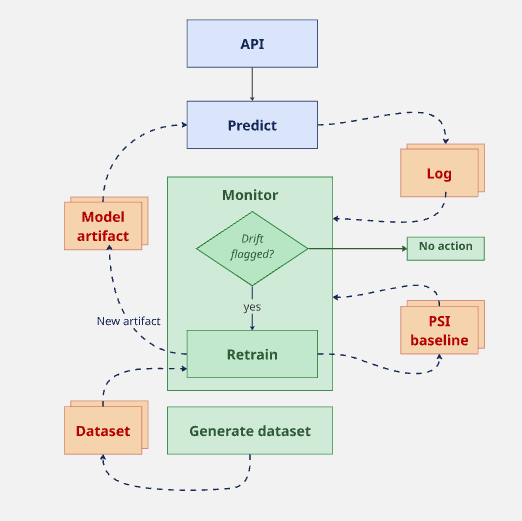

# Retrain loop

## Introduction

Calls to the predict API are logged along with the prediction given. The monitor script goes through new predictions and computes PSI (Population Stability Index) against the training baseline. If PSI exceeds a threshold, drift is flagged. When drift is flagged, retraining runs automatically within the same script call, producing a new model trained on the most recent data available.

Two manual actions drive this system: `generate_dataset.py` refreshes the dataset on disk, and `monitor.py` checks for drift and retrains if flagged. They're independent, running one doesn't trigger the other. If you want retraining to reflect fresher data, run `generate_dataset.py` before `monitor.py`; otherwise, retraining just uses whatever dataset is currently on disk, which could be stale.

## Walkthrough

### API

The API consists of two endpoints:
- `/health` returns 200 if the API is up and running
- `/predict` takes in feature values and returns a prediction with per-class probabilities

### Predict

The predict function loads the model from disk on every call, rather than caching it in memory. This means a new model artifact written to disk (for example after a retrain) is picked up automatically on the very next request, with no restart or reload step needed.

Each prediction is logged to a JSONL file, one JSON object per line, containing the timestamp, all feature values, the predicted class, and the per-class probabilities. Logging failures are non-fatal: if the write fails, the prediction is still returned to the caller and the error is logged instead.

### Monitor

`monitor.py` runs separately from the API and prediction path. It's a manually triggered script, not a scheduled job.

On each run, it:
1. Reads a metadata file recording when the model was last trained and when monitoring last ran, and uses the later of the two as the cutoff. This way, a retrain resets what counts as "already checked," so predictions from before the current model existed are never re-evaluated.
2. Loads only predictions logged after that cutoff from the prediction log.
3. Computes PSI on the pooled feature distributions of those new predictions against the training baseline. PSI is computed globally, not split by predicted class, to avoid circularity from grouping live data by the model's own, potentially drifting, predictions.
4. If PSI exceeds the threshold for any feature, drift is flagged and retraining is triggered immediately, within the same run.
5. Updates the monitoring metadata regardless of whether drift was flagged, so the next run only checks predictions logged since this one.

### Retrain

Retraining is not a separate manual step. It only ever runs as a consequence of `monitor.py` flagging drift. There is no standalone way to trigger it directly.

When triggered, retraining:
1. Loads the dataset currently on disk (produced by whichever `generate_dataset.py` run was most recent; retraining does not refresh the dataset itself).
2. Trains a new baseline model on data up to the current date.
3. Calculates a new baseline for the PSI calculation
3. Saves a new model artifact, schema, and PSI baseline, along with metadata recording the training date range and timestamp.

Because the API loads the model fresh on every request, this new artifact is served automatically, with no deployment step, restart, or manual handoff required.

### Generate dataset

`generate_dataset.py` downloads raw AIS data from the Danish Maritime Authority, aggregates it, and produces the processed feature dataset used for training. This is run manually and independently of everything else in the loop.

The download step takes a long time, so this isn't something that runs as part of a normal predict/monitor cycle. Whatever dataset is currently on disk is what retraining will use, regardless of how recently it was generated. Running this script has no effect until a retrain is triggered afterward.

## Known limitations

- **Nothing is scheduled.** Both `generate_dataset.py` and `monitor.py` are run by hand. A production deployment would likely run these on a schedule (for example weekly) instead.
- **Dataset freshness isn't checked.** Retraining silently uses whatever dataset is on disk, even if it's stale. Nothing currently warns if `generate_dataset.py` hasn't been run recently.
- **Drift is checked on pooled features, not per predicted class.** This avoids circularity (grouping live data by the model's own predictions) but means drift concentrated in one vessel type won't be visible as such, only as an aggregate signal.
